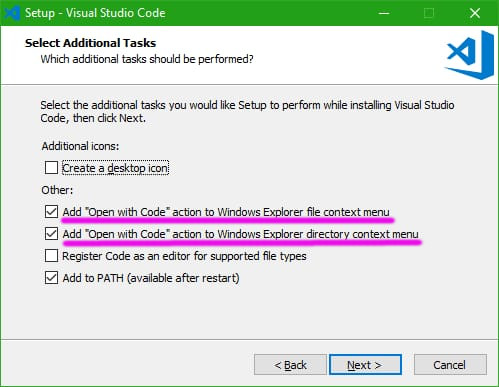
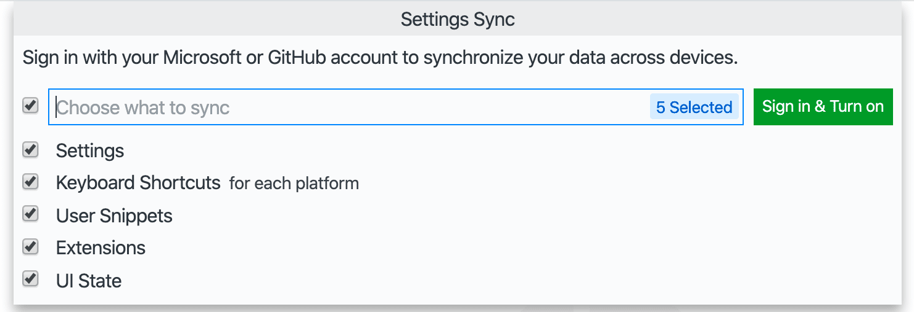
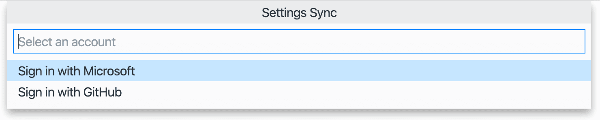

# NODE EXAMPLE

## TOOLS NEEDED TO RUN THE PROJECT

* **_VISUAL STUDIO CODE_ (_VSCODE_)**:
  * DOWNLOAD _VSCODE_ [HERE](https://code.visualstudio.com/download).
  * INSTALL _VSCODE_. IF YOU ARE USING WINDOWS, MAKE SURE TO CHECK THE FOLLOWING OPTIONS DURING THE INSTALLATION PROCESS:
    * "Add 'Open With Code" action to Windows Explorer file context menu"
    * "Add 'Open With Code' action to Windows Explorer directory context menu"

* **_GIT_ AND _GITHUB_ (VERSION CONTROL SYSTEM):**
  * CREATE A GITHUB ACCOUNT ON [https://github.com](https://github.com)
  * DOWNLOAD _GIT_ [HERE](https://git-scm.com/downloads).
  * INSTALL _GIT_.
  * CONFIGURE _GIT_ USERNAME AND E-MAIL:
    * TYPE THE FOLLOWING COMMANDS ON THE VSCODE TERMINAL:
      * `git config --global user.name "TYPE YOUR NAME HERE"`
      * `git config --global user.email your_email_in_github@provider.com`
  * SYNCHRONIZE VSCODE WITH GITHUB ACCOUNT:
    * OPEN VSCODE.
    * PRESS _Ctrl + Shift + P_.
    * TYPE `Settings Sync: Turn On...`.
      * KEEP ALL OPTIONS CHECKED AND CLICK ON _Sign In & Turn On_ BUTTON
      * CHOOSE _Sign in with GitHub_. 

* **_NODE_ AND _NODE PACKAGE MANAGER_ (_NPM_)**:
  * DOWNLOAD _NODE/NPM_ [HERE](https://nodejs.org/en/download/).
  * INSTALL _NODE/NPM_.
  * CHECK IF _NODE_ IS INSTALLED BY TYPING `node -v` ON VSCODE TERMINAL.
  * CHECK IF _NPM_ IS INSTALLED BY TYPING `npm -v` ON VSCODE TERMINAL.

## PROJECT CREATION

* CONFIGURE EXECUTION POLICY:
  * RUN _VSCODE_ AS ADMINISTRATOR AND RUN THE FOLLOWING COMMAND IN TERMINAL:
    * `Set-ExecutionPolicy RemoteSigned`

* CREATE FOLDERS:
  * CREATE FOLDER _folderSource_.
  * CREATE FOLDER _folderExamples_ IN _folderSource_.
  * CREATE FOLDER _folderModules_ IN _folderSource_.
  * CREATE FOLDER _folderViews_ IN _folderSource_.

* EXAMPLE (HELLO WORLD WITH _NODE_):
  * CREATE _exampleHelloWorld.js_ IN _folderExamples_.
  * `node ./folderSource/folderExamples/exampleHelloWorld.js`

* _PRETTIER_ (CODE FORMATTER):
  * INSTALL _PRETTIER_ EXTENSION IN _VSCODE_.
  * CREATE _.prettierrc_ FILE. THIS FILE WILL CONTAIN _PRETTIER_ CONFIGURATIONS.
  * CREATE _.prettierignore_ FILE. THIS FILE WILL CONTAIN A LIST OF FILE TYPES IGNORED BY _PRETTIER_.

* CREATE README.md

* INITIALIZE THE NODE PACKAGE MANAGER (NPM):
  * `npm init -y` (THIS IS GOING TO CREATE THE FILE _package.json_)

* ENABLE ES6 IMPORTS/EXPORTS BY ADDING THE FOLLOWING LINE TO _package.json_:
  * `"type": "module",`

* _ESLINT_ PACKAGE (CODE ANALYSIS TOOL):
  * INSTALL _ESLINT_ EXTENSION IN VSCODE.
  * INSTALL PACKAGE: `npm install -D eslint`
  * CREATE _.eslintrc.json_ (CONFIGURATIONS FOR ESLINT):
    * `npm init @eslint/config` (OR `npx eslint --init`) (OR `./node_modules/.bin/eslint --init`)
      * ANSWER THE FOLLOWING QUESTIONS:
        * How would you like to use ESLint?
              - To check syntax, find problems, and enforce code style
        * What type of modules does your project use?
              - JavaScript modules (import/export)
        * Which framework does your project use?
              - None of these
        * Does your project use TypeScript?
              - Yes
        * Where does your code run?
              - Node
        * How would you like to define a style for your project?
              - Answer questions about your style
        * What format do you want your config file to be in?
              - JSON
        * What style of indentation do you use?
              - Tabs
        * What quotes do you use for strings?
              - Double
        * What line endings do you use?
              - Windows
        * Do you require semicolons?
              - Yes
        * @typescript-eslint/eslint-plugin@latest @typescript-eslint/parser@latest Would you like to install them now with npm?
              - Yes
  * ADD THE FOLLOWING LINE TO THE RULES PROPERTY IN _.eslintrc.json_ TO REQUIRE _comma-dangle_:
    * `"comma-dangle": [1, "always-multiline"],`
  * REPLACE THE _quotes_ PROPERTY IN _.eslintrc.json_ TO ENABLE TEMPLATE LITERALS:
    * `"quotes": ["error", "double", { "allowTemplateLiterals": true }],`

* _NODEMON_ PACKAGE (MONITOR THAT WATCHES FOR FILE CHANGES AND AUTOMATICALLY RESTARTS THE NODE APLICATTION):
  * INSTALL PACKAGE: `npm install -D nodemon`

* EXAMPLE (HELLO WORLD WITH _NODEMON_):
  * `npx nodemon ./folderSource/folderExamples/exampleHelloWorld.js`

* _GIT_:
  * `git init`
  * CREATE _.gitignore_ FILE. THIS FILE WILL CONTAIN A LIST OF ALL FILES AND FOLDERS IGNORED BY _GIT/GITHUB_.
  * ADD `node_modules` AS A NEW LINE IN _.gitignore_.

* EXAMPLE (_TEMPLATE STRINGS_ WITH _NODEMON_):
  * CREATE _exampleTemplateStrings.js_ IN _folderExamples_.
  * `npx nodemon ./folderSource/folderExamples/exampleTemplateStrings.js`

* _DOTENV_ PACKAGE (ENVIRONMENT VARIABLES):
  * INSTALL _DOTENV_ EXTENSION IN VSCODE.
  * INSTALL PACKAGE: `npm install dotenv`
  * CREATE _.env_ FILE. THIS FILE WILL CONTAIN ENVIRONMENTAL VARIABLES AVAILABLE THROUGH `process.env.variablename`.
  * ADD `.env` AS A NEW LINE IN `.gitignore` (GOOD PRACTICE).

* EXAMPLE (_DOTENV_):
  * CREATE FILE _exampleDotenv.js_ IN _folderExamples_.
  * `npx nodemon ./folderSource/folderExamples/exampleDotenv.js`

* _EXPRESS_ PACKAGE:
  * INSTALL PACKAGE: `npm install express`
  * INSTALL TYPE DEFINITIONS: `npm install -D @types/express` (ONLY IF WORKING WITH _TYPESCRIPT_)

* EXAMPLE (_EXPRESS_):
  * CREATE _exampleExpress.js_ IN _folderExample_.
  * `npx nodemon ./folderSource/folderExamples/exampleExpress.js`

* _EJS_ PACKAGE (TEMPLATING LANGUAGE):
  * INSTALL PACKAGE: `npm install ejs`

* EXAMPLE (_EJS_):
  * CREATE FILE _exampleEjs.js_ IN _folderExamples_.
  * CREATE FILE _template.ejs_ IN _folderViews_.
  * `npx nodemon ./folderSource/folderExamples/exampleEjs.js`

* EXAMPLE MIDDLEWARES:
  * CREATE _exampleMiddlewares.js_ IN _folderExamples_.
  * `npx nodemon ./folderSource/folderExamples/exampleMiddlewares.js`
