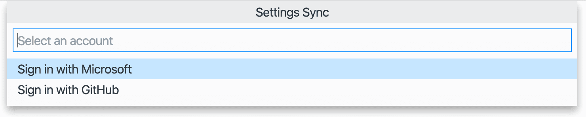

# SYNCHRONIZE VSCODE WITH GITHUB ACCOUNT

* OPEN VSCODE.
* PRESS _Ctrl + Shift + P_.
* TYPE `Settings Sync: Turn On...`.
  * KEEP ALL OPTIONS CHECKED AND CLICK ON _Sign In & Turn On_ BUTTON 
  * CHOOSE _Sign in with GitHub_. 

[BACK](../../README.md)
