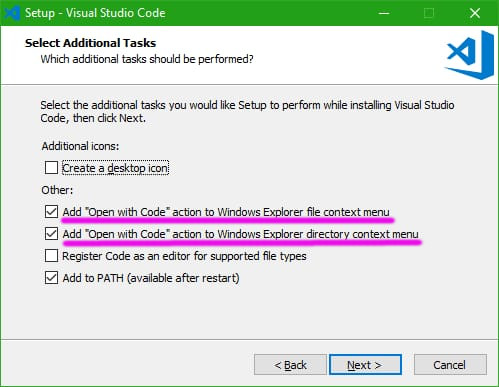

# _VISUAL STUDIO CODE_ (_VSCODE_) INSTALLATION

* DOWNLOAD _VSCODE_ [HERE](https://code.visualstudio.com/download).
* INSTALL _VSCODE_.
  * IF YOU ARE USING WINDOWS, MAKE SURE TO CHECK THE FOLLOWING OPTIONS DURING THE INSTALLATION PROCESS:
    * "Add 'Open With Code" action to Windows Explorer file context menu"
    * "Add 'Open With Code' action to Windows Explorer directory context menu"

[BACK](../../README.md)
