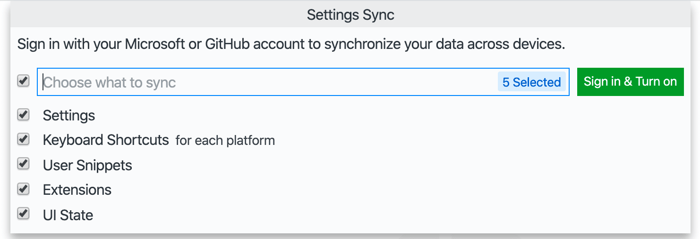

# _GIT_ AND _GITHUB_

## DESCRIPTION

EXAMPLE AND INSTRUCTIONS TO CONFIGURE:

* [_GIT_](https://git-scm.com): A VERSION CONTROL SYSTEM
* _GITHUB_.

## DOWNLOAD

DOWNLOAD _GIT_ [HERE](https://git-scm.com/downloads).

## INSTALLATION

* ON WINDOWS: JUST RUN THE EXECUTABLE.

## CONFIGURATION

* CREATE A _GITHUB_ ACCOUNT [HERE](https://github.com).

* CONFIGURE _GIT_ USERNAME AND E-MAIL:
  * TYPE THE FOLLOWING COMMANDS ON THE VSCODE TERMINAL:
    * `git config --global user.name "TYPE YOUR NAME HERE"`
    * `git config --global user.email your_email_in_github@provider.com`

## SYNCHRONIZE VSCODE SETTINGS WITH GITHUB ACCOUNT

* OPEN VSCODE.
* PRESS _Ctrl + Shift + P_.
* TYPE `Settings Sync: Turn On...`.
  * KEEP ALL OPTIONS CHECKED AND CLICK ON _Sign In & Turn On_ BUTTON 
  * CHOOSE _Sign in with GitHub_. 

## EXAMPLE OF REPOSITORY INITIALIZATION

* OPEN YOUR PROJECT FOLDER IN VSCODE AND TYPE THE FOLLOWING LINE ON TERMINAL:

```bash
git init
```

* CREATE [_.gitignore_](../.gitignore) FILE. THIS FILE WILL CONTAIN A LIST OF ALL FILES AND FOLDERS IGNORED BY _GIT/GITHUB_.
* ADD `node_modules` AS A NEW LINE IN [_.gitignore_](../.gitignore).
