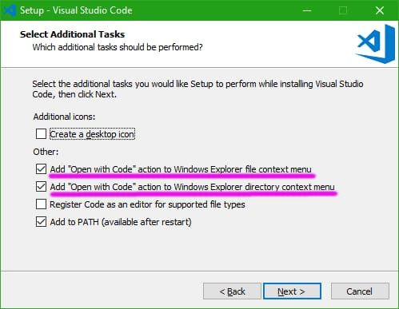

# _VISUAL STUDIO CODE_ (_VSCODE_) INSTALLATION

## DOWNLOAD

DOWNLOAD _VSCODE_ [HERE](https://code.visualstudio.com/download).

## INSTALLATION

* IF YOU ARE USING WINDOWS, MAKE SURE TO CHECK THE FOLLOWING OPTIONS DURING THE INSTALLATION PROCESS:
  * "Add 'Open With Code" action to Windows Explorer file context menu"
  * "Add 'Open With Code' action to Windows Explorer directory context menu"


## CONFIGURATIONS

* CONFIGURE THE EXECUTION POLICY... OPEN _VSCODE_ AS ADMINISTRATOR AND RUN THE FOLLOWING COMMAND IN TERMINAL:

  ```bash
  Set-ExecutionPolicy RemoteSigned
  ```  
